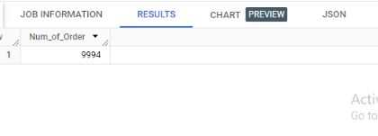
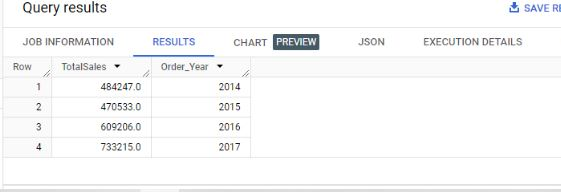
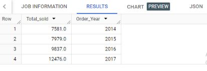
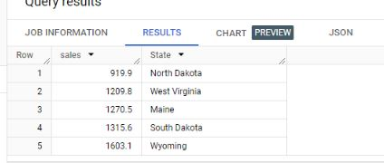
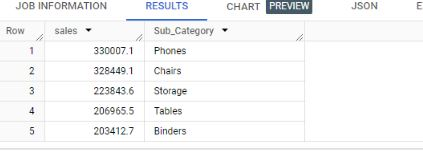
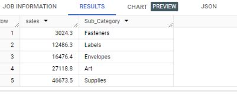
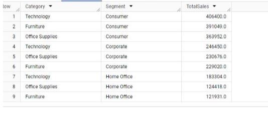
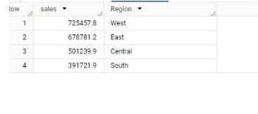
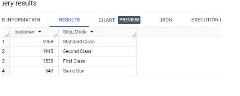

# SUPERSTORE SALES ANALYSIS

_Unlocking Superstore Insights: Exploring Data in Bigquery with SQL_

In the world of business, data-driven decisions are essential to success(rephrase this). Sales fIgure provide important insights to the performance of a company's products and regions. And one of the powerful data analysis tools that can be used to get insights from datasets is **SQL**.


                                        _stationery store_


##  PROJECT OVERVIEW

In this project, I utilized Excel, SQL, and Power BI in the analysis of the Super store dataset from Kaggle. 
The Super store is located in the United State and they sell stationeries. This Superstore data is hosted on Google BigQuery for the analysis. 
The purpose of this analysis is to understand and answer some business questions regarding the performance of the Superstore, gain insights, and provide some recommendations to increase revenue.
At the time of analysis, the Superstore recorded sales transaction data from 2014 – 2017. The entire data can be accessed here [superstore dataset](https://www.kaggle.com/datasets/ishanshrivastava28/superstore-sales)

### Data Cleaning Process

The first step I took in the data analysis process was to import the Superstore dataset into Excel for data cleaning to check for errors and inconsistencies. The Superstore dataset comprises of information such as; Sales, Customer Name, Order date, Delivery date, Product category, Ship mode, Country, Region, Product Subcategory, Product Segment, Postal code.

I followed the following steps for the Data cleaning process;

- Data Importation: To kick start with this analysis, I firstly imported the dataset from the File ribbon into the excel spreadsheet.


- Data Cleaning:  To check the dataset for duplicates, I highlighted the whole columns from A to V, then clicked on the Data ribbon on remove duplicates but no duplicates was found.


Then I proceeded to filter each column to check for blanks, errors, misspellings or any outliers for further data cleaning. 

I discovered inconsistencies in the Order Date and Ship Date columns, I proceeded by coverting the Date value to Date with the Text to column tool in the Data ribbon as follows;


  Old Order date column     				                    |     					New Order Date column
:-------------------------------------------------------|:---------------------------------------------------------:
						                              |	


- Data Transformation: In order to calculate the Delivery day, a new column was inserted and the DATEDIF function was used to find the difference between the Ship date and Order date.


 Before                      				                    |     				After
:-------------------------------------------------------|:---------------------------------------------------------:
						                            |	


## BUSINESS QUESTIONS
  
In order to further analyze the data to gain insights and find trends, the dataset was hosted on Bigquery to further find the KPIs for the Superstore to know its performance.
  
1. _**Total Revenue Generated**_
 
 The SUM function was used in calculating the total sales as shown in the image below;

```sql
SELECT  sum(Sales)
FROM `coastal-stone-366510.sales.superstore`
```


_Total Sales_- Image by Author


2. **Total number of order received**

  The Count function was used in getting the total number of order received as shown in the image below;
```sql
SELECT  count(Order_ID) AS Num_of_Order
FROM `coastal-stone-366510.sales.superstore`
```

 _Total Order_- Image by Author


3. **Total Quantities Sold**

The CAST function was used to convert the integer to FLOAT64 and the SUM was used to find the total quantity sold

```sql
SELECT CAST(SUM(Quantity) AS FLOAT64) as Total_Quantities
FROM `coastal-stone-366510.sales.superstore`
```
PICTURE!
_Total Quantities Sold_- Image by Author

4. **Total quantities sold per each Product Category**

```sql
SELECT CAST(SUM(Quantity) AS FLOAT64) as Total_Quantities, Category
FROM `coastal-stone-366510.sales.superstore`
GROUP BY Category
ORDER BY Total_Quantities desc
```
PICTURE!
 _Total Order_- Image by Author
   
4. **Sales made per each year**

The EXTRACT function was used get the unique year number and the SUM function was used to get yearly sales as shown in the image below

```sql
SELECT ROUND(SUM(sales), 0) AS TotalSales, EXTRACT(YEAR FROM Order_Date) AS Order_Year
FROM coastal-stone-366510.sales.superstore
GROUP BY Order_Year
ORDER BY Order_Year;
```


 _Yearly Sales_- Image by Author

6. **Total Quantites Sold per each year**

```sql
SELECT CAST(SUM(Quantity) AS FLOAT64) as Total_Quantities, EXTRACT(YEAR FROM Order_Date) AS Order_Year
FROM `coastal-stone-366510.sales.superstore`
GROUP BY Order_Year
ORDER BY Order_Year
```


_Yearly Sales_- Image by Author


5. **States with the highest and least sales**
a. TOP5
```sql
SELECT round(sum(Sales),1) as sales, State
FROM `coastal-stone-366510.sales.superstore` 
GROUP BY State
ORDER BY sales desc
LIMIT 5
```
PICTURE!

_Top 5 States in Sales_ - Image by Author

b. BOTTOM5
```sql
SELECT round(sum(Sales),1) as sales, State
FROM `coastal-stone-366510.sales.superstore` 
GROUP BY State
ORDER BY sales asc
LIMIT 5
```
 NEW!

_Least 5 States in Sales_ - Image by Author


6. What are the highest sold products and the least sold  products in sales?

TOP5 Products in sales                 				           
```sql
SELECT round(sum(sales),1) as sales, Sub_Category 
FROM `coastal-stone-366510.sales.superstore` 
GROUP BY Sub_Category
ORDER BY sales desc
LIMIT 5
```




BOTTOM5 Products in sales
```sql
SELECT round(sum(sales),1) as sales, Sub_Category 
FROM `coastal-stone-366510.sales.superstore` 
GROUP BY Sub_Category
ORDER BY sales 
LIMIT 5
```



7. **Sales by Product categories and Segment*8

```sql
SELECT Category, Segment, round(sum(Sales),0) as TotalSales
FROM `coastal-stone-366510.sales.superstore`
GROUP BY Category,Segment
ORDER BY TotalSales desc
```


   
7. **Sales by Region**

```sql
SELECT  round(sum(Sales),1) as sales, Region
FROM `coastal-stone-366510.sales.superstore`
GROUP BY Region
ORDER BY sales desc
```



8. **Shipmode by Customer's preference**

```sql
SELECT count(Customer_ID) as customer, Ship_Mode
 FROM `coastal-stone-366510.sales.superstore` 
 GROUP BY Ship_Mode
 ORDER BY customer desc
```


