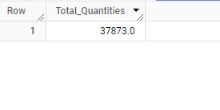
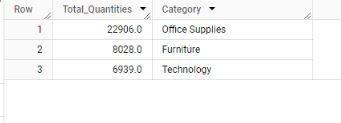
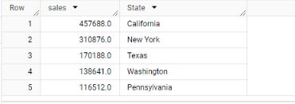
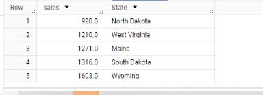
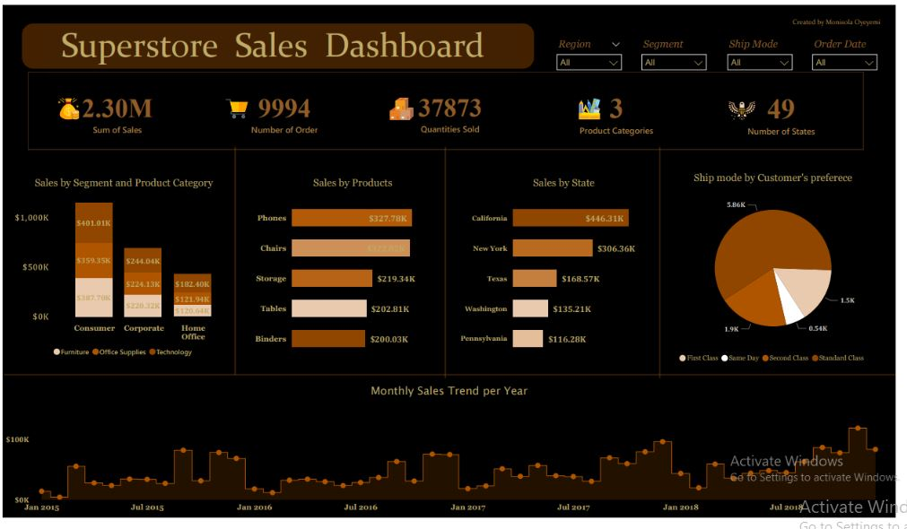

# SUPERSTORE SALES ANALYSIS

_Unlocking Superstore Insights: Exploring Data in Bigquery with SQL_

In the world of business, making decisions based on data is crucial in achieveing success. Sales figure provide important insights to the performance of a company's products and regions. And one of the powerful data analysis tools that can be used to get insights from datasets is **SQL**.


                                        _stationery store_


##  PROJECT OVERVIEW

In this project, I utilized Excel, SQL, and Power BI in the analysis of the Super store dataset from Kaggle. 
The Super store is located in the United State where  the stationeries are being sold. This Superstore data is hosted on Google BigQuery for the analysis. 
The purpose of this analysis is to understand and answer some business questions regarding the performance of the Superstore, gain insights, and provide some recommendations to increase revenue.
At the time of analysis, the Superstore recorded sales transaction data from 2014 – 2017. The entire data can be accessed here [superstore dataset](https://www.kaggle.com/datasets/ishanshrivastava28/superstore-sales)

### Data Cleaning Process

The first step I took in the data analysis process was to import the Superstore dataset into Excel for data cleaning to check for errors and inconsistencies. The Superstore dataset comprises of information such as; Sales, Customer Name, Order date, Delivery date, Product category, Ship mode, Country, Region, Product Subcategory, Product Segment, Postal code.

I followed the following steps for the Data cleaning process;

- Data Importation: To kick start with this analysis, I firstly imported the dataset from the File ribbon into the excel spreadsheet.


- Data Cleaning:  To check the dataset for duplicates, I highlighted the whole columns from A to V, then clicked on the Data ribbon on remove duplicates but no duplicates was found.


Then I proceeded to filter each column to check for blanks, errors, misspellings or any outliers for further data cleaning. 

I discovered inconsistencies in the Order Date and Ship Date columns, I proceeded by coverting the Date value to Date with the Text to column tool in the Data ribbon as follows;


  Old Order date column     				                    |     					New Order Date column
:-------------------------------------------------------|:---------------------------------------------------------:
						                              |	


- Data Transformation: In order to calculate the Delivery day, a new column was inserted and the DATEDIF function was used to find the difference between the Ship date and Order date.


 Formula                      				                  |     				Result
:-------------------------------------------------------|:---------------------------------------------------------:
						                            |	


## BUSINESS QUESTIONS
  
In order to further analyze the data to gain insights and find trends, the dataset was hosted on Bigquery to further find the KPIs for the Superstore to know its performance.
  
1. _**Total Revenue Generated**_
 
 The SUM function was used in calculating the total sales as shown in the image below;

```sql
SELECT  sum(Sales)
FROM `coastal-stone-366510.sales.superstore`
```


2. _**Total number of order received**_

  The COUNT function was used in calculating the total number of order received as shown in the image below;

```sql
SELECT  count(Order_ID) AS Num_of_Order
FROM `coastal-stone-366510.sales.superstore`
```

 

3. _**Total Quantities Sold**_

The CAST function was used to convert the integer to FLOAT64 and the SUM was used to calculate the total quantity sold as shown in the image below;

```sql
SELECT CAST(SUM(Quantity) AS FLOAT64) as Total_Quantities
FROM `coastal-stone-366510.sales.superstore`
```



4. _**Total quantities sold per each Product Category**_

The CAST function was used to convert the integer to FLOAT64 and the SUM was used to find the total quantity sold. The GROUP BY was used to group the different product categories as shown in the image below;

```sql
SELECT CAST(SUM(Quantity) AS FLOAT64) as Total_Quantities, Category
FROM `coastal-stone-366510.sales.superstore`
GROUP BY Category
ORDER BY Total_Quantities desc
```

 
   
5. _**Sales made per each year**_

The EXTRACT function was used get the unique year number and the SUM function was used to get yearly sales as shown in the image below;

```sql
SELECT ROUND(SUM(sales), 0) AS TotalSales, EXTRACT(YEAR FROM Order_Date) AS Order_Year
FROM coastal-stone-366510.sales.superstore
GROUP BY Order_Year
ORDER BY Order_Year;
```


 

6. _**Total Quantites Sold per each year**_

The EXTRACT function was used get the unique year number and the SUM and CAST functions were used to get quantities sold for each year as shown in the image below;

```sql
SELECT CAST(SUM(Quantity) AS FLOAT64) as Total_Quantities, EXTRACT(YEAR FROM Order_Date) AS Order_Year
FROM `coastal-stone-366510.sales.superstore`
GROUP BY Order_Year
ORDER BY Order_Year
```


7. _**States with the highest and least sales**_

a. _TOP5_
 
The SUM function was used to calcualte the total sales for each product sub-category and ordered in ascending order to get the bottom5 products in sales as shown in the image below;

```sql
SELECT round(sum(Sales),1) as sales, State
FROM `coastal-stone-366510.sales.superstore` 
GROUP BY State
ORDER BY sales desc
LIMIT 5
```



b. _BOTTOM5_

The SUM function was used to calcualte the total sales for each product sub-category and ordered in ascending order to get the bottom5 products in sales as shown in the image below;

```sql
SELECT round(sum(Sales),1) as sales, State
FROM `coastal-stone-366510.sales.superstore` 
GROUP BY State
ORDER BY sales asc
LIMIT 5
```



8. _**What are the highest sold products and the least sold  products in sales?**_

_TOP5 Products in sales_  

The SUM function was used to calcualte the total sales for each product sub-category and ordered in descending order to get the top5 products in sales as shown in the image below;

```sql
SELECT round(sum(sales),1) as sales, Sub_Category 
FROM `coastal-stone-366510.sales.superstore` 
GROUP BY Sub_Category
ORDER BY sales desc
LIMIT 5
```


The SUM function was used to calcualte the total sales for each product sub-category and ordered in ascending order to get the bottom5 products in sales as shown in the image below;

```sql
SELECT round(sum(sales),1) as sales, Sub_Category 
FROM `coastal-stone-366510.sales.superstore` 
GROUP BY Sub_Category
ORDER BY sales 
LIMIT 5
```


9. _**Sales by Product categories and Segment**_

The SUM function was used to calcualte the total sales for each product segment and category as shown in the image below;

```sql
SELECT Category, Segment, round(sum(Sales),0) as TotalSales
FROM `coastal-stone-366510.sales.superstore`
GROUP BY Category,Segment
ORDER BY TotalSales desc
```


   
10. _**Sales by Region**_

The SUM function was used to calcualte the total sales for each region as shown in the image below;

```sql
SELECT  round(sum(Sales),1) as sales, Region
FROM `coastal-stone-366510.sales.superstore`
GROUP BY Region
ORDER BY sales desc
```


11. _**Shipmode by Customer's preference**_
 
 The COUNT function was used to calculate the number of customers as shown in the image below;

```sql
SELECT count(Customer_ID) as customer, Ship_Mode
 FROM `coastal-stone-366510.sales.superstore` 
 GROUP BY Ship_Mode
 ORDER BY customer desc
```


## INSIGHTS
- The total revenue generated between 2014 and 2017 was $2,297,200
- The total quantities sold was 37873 units
- The total number of order received was 9994
- The products sold in the Superstore are divided into three categories: Office supplies, Technology and Furniture.  Office supplies ($22,906) had the highest sales, followed by Furniture ($8,208) while Technology ($6,939) had the least sales
- Total sales($2.3M) increased positively over the years from 2014 to 2017 and so was the total quantities sold.
- The West region had the highest sales ($725458), followed by East ($678781) then Central ($501240) while the South region had the least sales ($391722).
- The State with the highest sales was California ($457687) while North Dakota had the least sales ($920)
- Their top5 products sold are Phones, Chairs, Storage, Tables and Binders while the bottom5 are Supplies, Art, Envelopes, Labels and Fasteners
- Standard class was the most preferred by 5968 customers, followed by Second class preferred by 1945 customers, followed by First class preferred by 1538 customers and lastly Same day preferred by 543 customers for delivery mode.


## RECOMMENDATIONS
Based on the insightful analysis of the Superstore sales data, I would like to give the following recommendations: 

1. The Superstore should invest more in stocking Phones, Chairs, Storage, Tables and Binders to increase sales and they should be made readily aailable at all times.
2. The South region has the lowest sales figure, marketing strategies and awareness campaign should be implemented in this region to boost sales.
3. Special attention must be paid to the swift and efficient delivery to the Standard class since it is most preffered by the customers and thereby drove in most sales.

## DASHBOARD

A dashboard refers to a visual representation of data that provides a summary and analysis of key information. It consist of charts, graphs, tables and other visual elements that allow users to understand complex data sets. Power BI was used to design the dashboard.

Dashboards allow companies to monitor key performance indicators(KPIs) and track progress towards goals. By providing a real-time or near real-time data, dashboards provide a snapshot of performance and enable teams to identify areas of success that needs attention.




## CONCLUSION 
In conclusion, this comes to the end of my analysis of the Superstore sales data which demonstrate the power of data analysis in making data-driven business decisions. By transforming and analyzing the sales data, I have been able to provide insights and actionable recommendations which can guide the Superstore in enhancing their sales performance.
