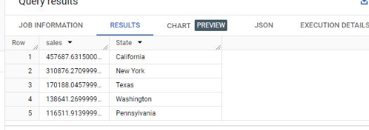

# SUPERSTORE SALES ANALYSIS

_Unlocking Superstore Insights: Exploring Data in Bigquery with SQL_

In the world of business, data-driven decisions are essential to success(rephrase this). Sales fIgure provide important insights to the performance of a company's products and regions. And one of the powerful data analysis tools that can be used to get insights from datasets is **SQL**.

                                        _stationery store_

##  Introduction

In this project, I utilized Excel, SQL, and Power BI in the analysis of the Super store dataset from Kaggle. 
The Super store is located in the United State and they sell stationeries. This Superstore data is hosted on Google Big Query for the analysis. 
The purpose of this analysis is to understand and answer some business questions regarding the performance of the Look e-commerce marketplace, gain insights, and provide some recommendations to increase revenue.
At the time of analysis, the Superstore recorded sales transaction data from 2014 – 2017. The entire data can be accessed here [superstore dataset](https://www.kaggle.com/datasets/ishanshrivastava28/superstore-sales)

## Data Cleaning Process

The first step I took in the data analysis process was importing the Superstore dataset into Excel for data cleaning to check for errors and inconsistencies. The Superstore dataset comprises of information such as; Sales, Customer Name, Order date, Delivery date, Product category, Ship mode, Country, Region, Product Subcategory, Product Segment, Postal code.

I followed the following steps for the Data cleaning process;

- Data Importation: To kick start with this analysis, I firstly imported the dataset from the File ribbon into the excel spreadsheet.

- Data Cleaning:  To check the dataset for duplicates, I highlighted the whole columns from A to V, then clicked on the Data ribbon on remove duplicates but no duplicates was found.

Then I proceeded to filter each column to check for blanks, errors, misspellings or any outliers for further data cleaning. 

I discovered inconsistencies in the Order Date and Ship Date columns, I proceeded by coverting the Date value to Date with the Text to column tool in the Data ribbon as follows;

  Old Order date column     				                    |     					New Order Date column
:-------------------------------------------------------|:---------------------------------------------------------:
						                              |	

- Data Transformation: In order to calculate the Delivery day, a new column was inserted and the DATEDIF function was used to find the difference between the Ship date and Order date.

 Before                      				                    |     				After
:-------------------------------------------------------|:---------------------------------------------------------:
						                            |	

- BUSINESS QUESTIONS
  
  In order to further analyze the data to gain insights and find trends, the dataset was hosted on Bigquery to further find the KPIs for the Superstore to know its performance.
  
1. What is the total revenue generated?
 
 The sum function was used in calculating the total sales as shown in the image below;

  Query                  				                        |     				Result
:-------------------------------------------------------|:---------------------------------------------------------:
						                              |	

 _Total Sales_- Image by Author

_Insight_:
- The total revenue generated throughout the years is $22,972,000

2.  What is  the total number of order received?

  The Count function was used in getting the total number of order received as shown in the image below;

Query                  				                          |     				Result
:-------------------------------------------------------|:---------------------------------------------------------:
						                              |	

_Insight_:
The total number order received is 9994

3. What is the sales made per each year?

The EXTRACT function was used get the unique year number and the SUM function was used to get yearly sales as shown in the image below

 Query                  				                        |     				Result
:-------------------------------------------------------|:---------------------------------------------------------:
						                                |	

_Insight_:
- The sales increase steadily over the years. 2017 had the largest sales number

4. Which States had the highest and lowest sales?
 

TOP5 States in sales                   				           |     				Result
:-------------------------------------------------------|:---------------------------------------------------------:
						                              |	

BOTTOM5 States Sales                  				           |     				Result
:-------------------------------------------------------|:---------------------------------------------------------:
						                              |	

_Insight_:

5. What are the highest sold products and the least sold  products in sales?

TOP5 Products in sales                 				           |     				LOWEST5 Products.sql
:-------------------------------------------------------|:---------------------------------------------------------:
						                              |	

BOTTOM5 Products in sales                  				       |     				LOWEST5 Products Sales
:-------------------------------------------------------|:---------------------------------------------------------:
						                              |	

6. Sales by Product categories and Segment

   
7. Sales by Region

8. Shipmode by Customer's preference
   

